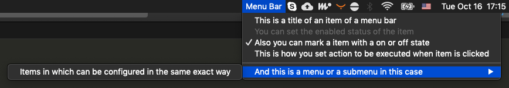

## Menu Bar

A declarative wrapper to easily define your **MenuBar**.

## Installation

To install it, simply add the following line to your Podfile:

```ruby
pod 'MenuBar', :git => 'https://github.com/IgorMuzyka/MenuBar.git'
```

## Usage

In order to construct your **MenuBar** you'll need to use **Descriptor** and **Parameter** values. **Descriptors** define ***items*** of the ***menu*** while **Parameters** allow to _configure_ the ***item***.

```swift
public enum Descriptor {
    case menu([Parameter], [Descriptor])
    case item([Parameter])
    case separator
}
```

```swift
public enum Parameter {
    case action(() -> Void)
    case title(String)
    case enabled(Bool)
    case state(NSControl.StateValue)
}
```

To construct a **MenuBar** simply create an instance like this.

```swift
let menuBar = MenuBar(descriptors: [
    .item([.title("This is a title of an item of a menu bar")]),
    .item([.title("You can set the enabled status of the item"), .enabled(false)]),
    .item([.title("Also you can mark a item with a on or off state"), .state(.on)]),
    .item([.title("This is how you set action to be executed when item is clicked"), .action({ print("click") })]),
    .separator, // and this is just a separator that will be visible between the items
    .menu([.title("And this is a menu or a submenu in this case")], [
        .item([.title("Items in which can be configured in the same exact way")])
    ])
])
```

In order to interact with a **MenuBar** you'll need to also give it an **image** or a **title** so that it can appear in the **MenuBar**.

```swift
menuBar.title = "Your app name"
```

or

```swift
menuBar.image = NSImage(named: "You app MenuBar icon")
```



> This is how the **MenuBar** we just created looks like.


Also **keep in mind** that you should **hold** the instance of **MenuBar** in order for it to **exist** and work properly. (App Delegate is an okay place to hold it).

Whenever you want to update the **MenuBar** just overwrite the it's **descriptors** property.

```swift
menuBar.descriptors = [
    .item([.title("Now this is the only item in menu bar")])
]
```

## Author

Igor Muzyka, igormuzyka42@gmail.com

## License

MenuBar is available under the MIT license. See the LICENSE file for more info.
